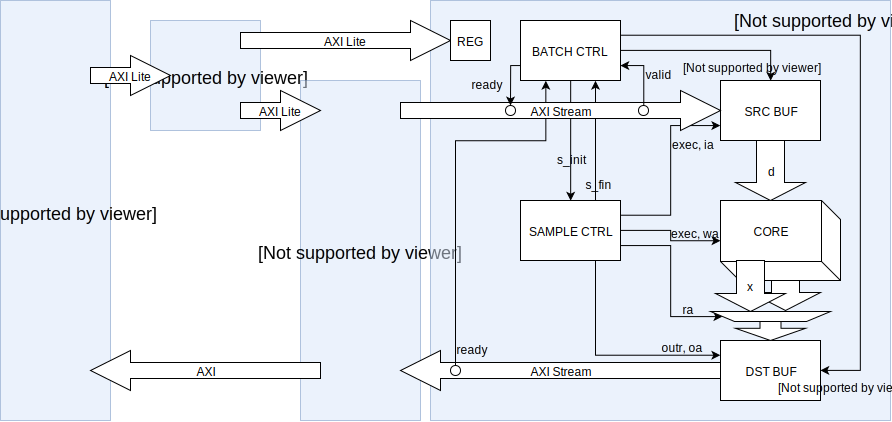
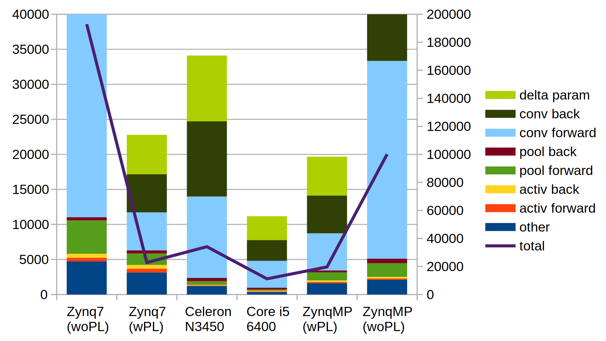
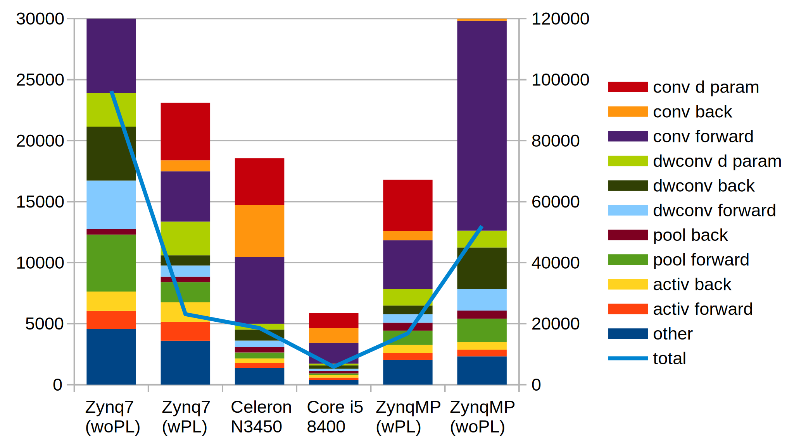

# tiny-dnn を FPGA で加速する

tiny-dnn の各レイヤを Zynq の PL 部に作ったアクセラレータ回路にオフロードすることで、CNN の学習を加速します。

オリジナルの [tiny-dnn のリポジトリ](https://github.com/tiny-dnn/tiny-dnn)

## 構成概要

畳み込みの行列乗算を 16MAC (bfloat16) で並列に計算して学習を加速します。  
AXI Stream で 1サンプル分のデータを受け取り、core で畳み込み計算をして、AXI Stream で 1サンプル分の結果を吐き出します。  
im2col は on the fly で実行するので、転送データとバッファメモリを節約できます。



## 実装例1: シンプル畳み込みニューラルネット

実装は ```examples/simple-conv``` です。課題は MNIST。

このくらい高速になります。  
ただし、次の変更をソフトウェアに入れています。

1. 入力データの傾きを求める計算をスキップする
2. 畳み込みレイヤで ΔW をミニバッチ分だけ累積する (FPGA(wPL)のみ)



### 使っている NN モデル


## 実装例2: Separable 畳み込みニューラルネット

実装は ```examples/DW-conv``` で作成中です。課題は MNIST。  
pooling レイヤと DW-conv レイヤーのアクセラレータ対応はまだできていません。



### 使っている NN モデル

真ん中の2個の conv3x3 は Depthwise Separable Convolution です。


